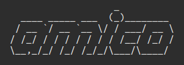

# amico: ATLAS Metadata Interface Comparator



# introduction

Datasets results returned by pyAMI are compared by amico. Specifically, AMI search patterns are specified and the short physics descriptions of results returned are compared. Results that match to a certain percentage are displayed.

# quick start

CC7 machines are recommended for using amico. It is recommended that amico be used with Python 2.7.5 or greater. A setup procedure could be something such as the following:

```Bash
ssh ${USER}@lxplus7.cern.ch
export ATLAS_LOCAL_ROOT_BASE=/cvmfs/atlas.cern.ch/repo/ATLASLocalRootBase
source $ATLAS_LOCAL_ROOT_BASE/user/atlasLocalSetup.sh
voms-proxy-init -voms atlas
localSetupPyAMI
```

A description of amico options is presented by requesting help:

```Bash
python --help
```

The form of an amico comparison run could be something such as the following:

```Bash
python amico.py --maxresults=10 --percentage=10
```
